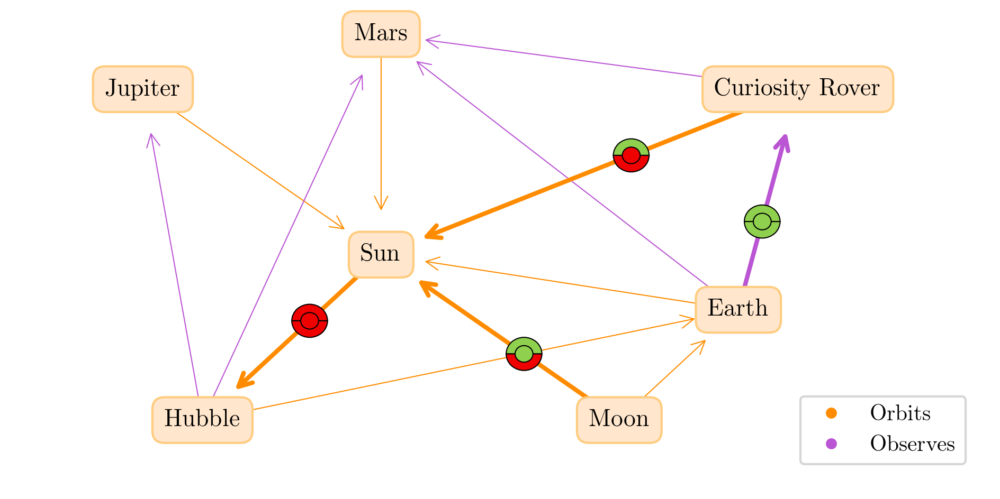

# Predictive Multiplicity for Classification and KGE

Content for the lecture "Machine Learning for Knowledge Graph Embeddings" during the wintersemester 2024/2025 by Prof. Stefan Staab.

## Abstract

In machine learning, models are designed to detect patterns from data, enabling tasks like image recognition and financial forecasting. Despite similar performance metrics, different models can yield conflicting predictions, a phenomenon known as multiplicity. This inconsistency, particularly in critical applications like recidivism prediction raises concerns about reliability and fairness. Building on foundational work, including Breiman's focus on interpretability and recent studies by Marx et al. and Zhu et al., this paper explores predictive multiplicity, consolidating definitions into a unified framework, providing illustrative examples, and proposing mitigation strategies. Our analysis aims to deepen understanding and guide future research in this emerging area.

## Content

The paper of Lukas Harsch and Jonathan Schnitzler, [here](ML_with_Graphs.pdf)

This repository contains

### Classification

#### XOR-Problem


Can be found in `classification` and the figures can be created via 

```bash
python3 clf_2D_diag.py
```

#### Other SVM Examples


#### Mushroom Dataset

Postponed till know, because too extensive.

### Knowledge Graph Embeddings

#### Own example


#### FB15k-237

To extensive to be used.
